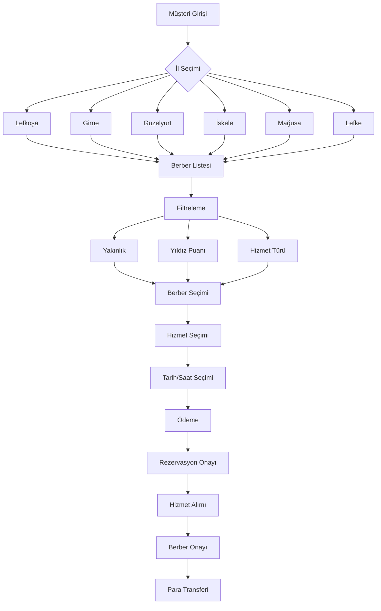

# Flowchart'ı Görsel Olarak Görme ve Kaydetme

## Yöntem 1: GitHub (En Kolay)
1. `visual_flowchart.md` dosyasını GitHub'a yükleyin
2. GitHub otomatik olarak Mermaid diagramları render eder
3. Direkt görsel olarak görürsünüz

## Yöntem 2: VS Code/Cursor Eklentisi
1. Mermaid eklentisi yüklendi (bierner.markdown-mermaid)
2. `visual_flowchart.md` dosyasını açın
3. Sağ üstte "Open Preview" butonuna tıklayın
4. Diagramları görsel olarak göreceksiniz

## Yöntem 3: Online Mermaid Editor
1. https://mermaid.live/ adresine gidin
2. Aşağıdaki kodları kopyalayıp yapıştırın:

### Ana Sistem Akışı:


3. "Actions" menüsünden "Download PNG" veya "Download SVG" seçin

## Yöntem 4: Cursor'da Preview
1. `visual_flowchart.md` dosyasını açın
2. `Ctrl+Shift+V` tuşlarına basın (Markdown Preview)
3. Diagramları görsel olarak göreceksiniz

## Yöntem 5: Mermaid CLI (Gelişmiş)
```bash
npm install -g @mermaid-js/mermaid-cli
mmdc -i visual_flowchart.md -o flowchart.png
```

## Önerilen Yöntem
**En kolay**: GitHub'a yükleyin veya https://mermaid.live/ kullanın
**En pratik**: Cursor'da Markdown Preview açın (Ctrl+Shift+V)
