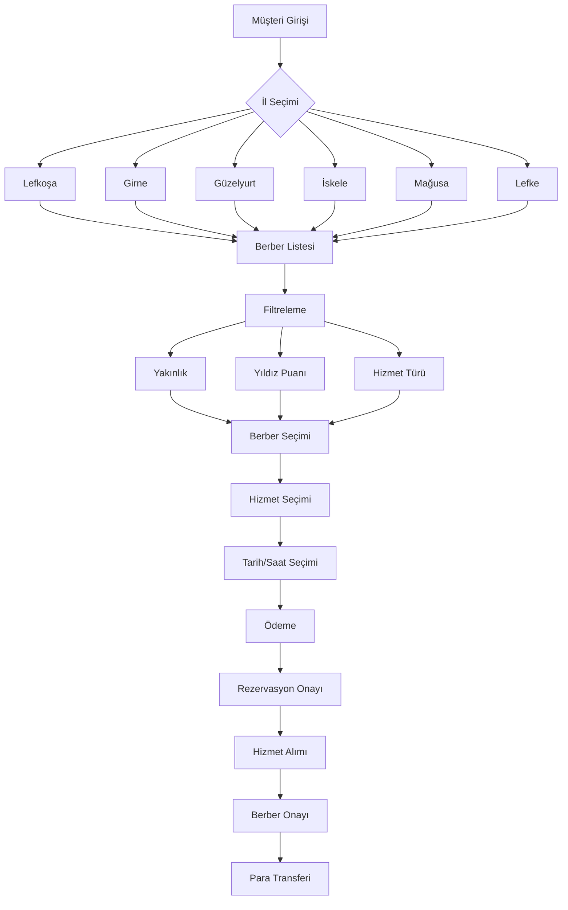

# Flowchart'ları PDF Olarak İndirme Rehberi

## Yöntem 1: GitHub'da Direkt PDF Export

### Adımlar:
1. https://github.com/EkremZii/berber-rezervasyon-sistemi/blob/main/visual_flowchart.md adresine gidin
2. Dosya açıldıktan sonra `Ctrl + P` tuşlarına basın
3. **Destination** olarak **"Save as PDF"** seçin
4. **Save** butonuna tıklayın

## Yöntem 2: Mermaid Live Editor ile PDF Export

### Adımlar:
1. https://mermaid.live/ adresine gidin
2. Aşağıdaki kodları tek tek kopyalayıp yapıştırın:

### Ana Sistem Akışı:


3. Her diagram için **"Actions"** menüsünden **"Download PNG"** veya **"Download SVG"** seçin
4. İndirilen dosyaları bir PDF editöründe birleştirin

## Yöntem 3: Browser Print to PDF

### Adımlar:
1. GitHub'da `visual_flowchart.md` dosyasını açın
2. `Ctrl + P` tuşlarına basın
3. **More settings** tıklayın
4. **Background graphics** seçeneğini işaretleyin
5. **Save as PDF** seçin

## Yöntem 4: Mermaid CLI ile PDF Export

### Kurulum:
```bash
npm install -g @mermaid-js/mermaid-cli
```

### Kullanım:
```bash
mmdc -i visual_flowchart.md -o flowchart.pdf
```

## Yöntem 5: Online PDF Converter

### Adımlar:
1. GitHub'da `visual_flowchart.md` dosyasını açın
2. Sayfayı kopyalayın
3. https://www.ilovepdf.com/tr/markdown_to_pdf gibi online converter kullanın
4. Markdown dosyasını yükleyin ve PDF'e çevirin

## Önerilen Yöntem
**En kolay**: GitHub'da `Ctrl + P` → Save as PDF
**En kaliteli**: Mermaid Live Editor → Download PNG → PDF'e çevir
