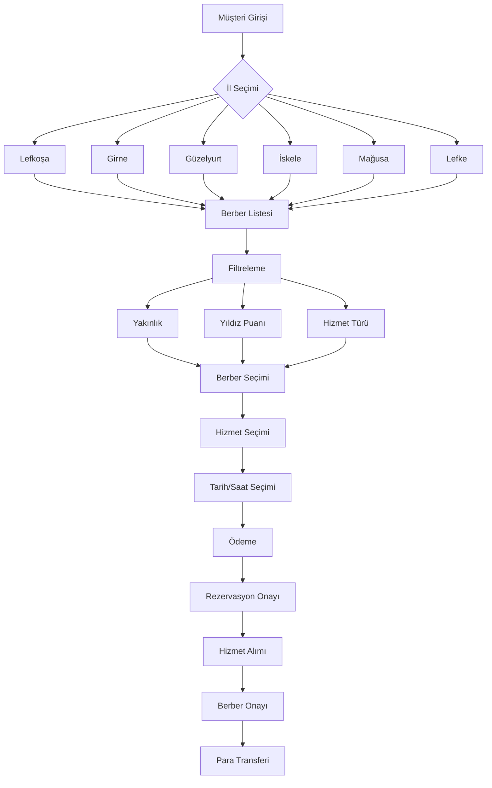
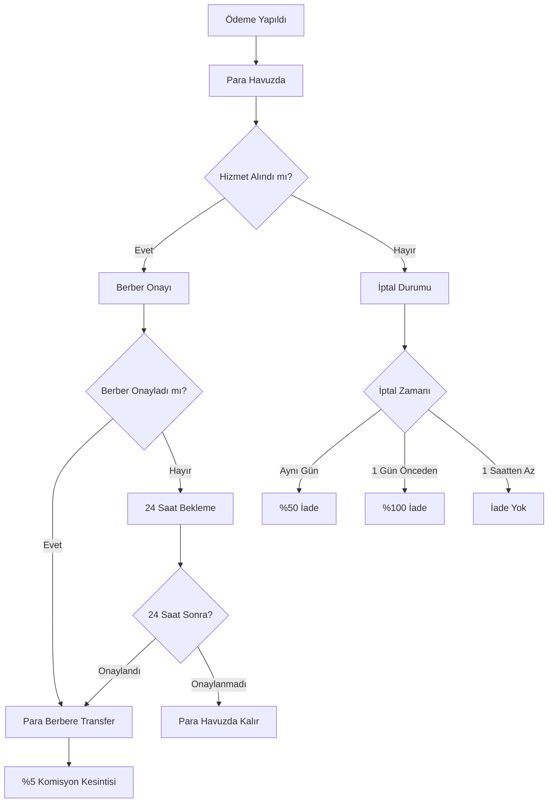
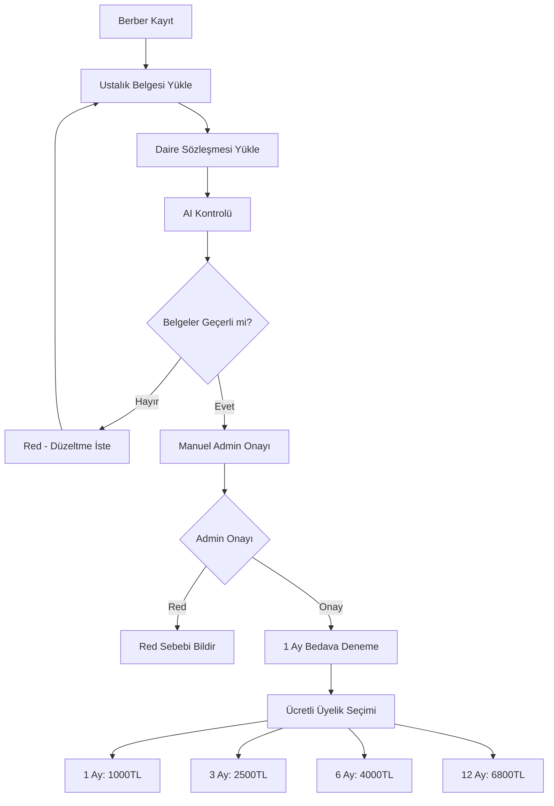
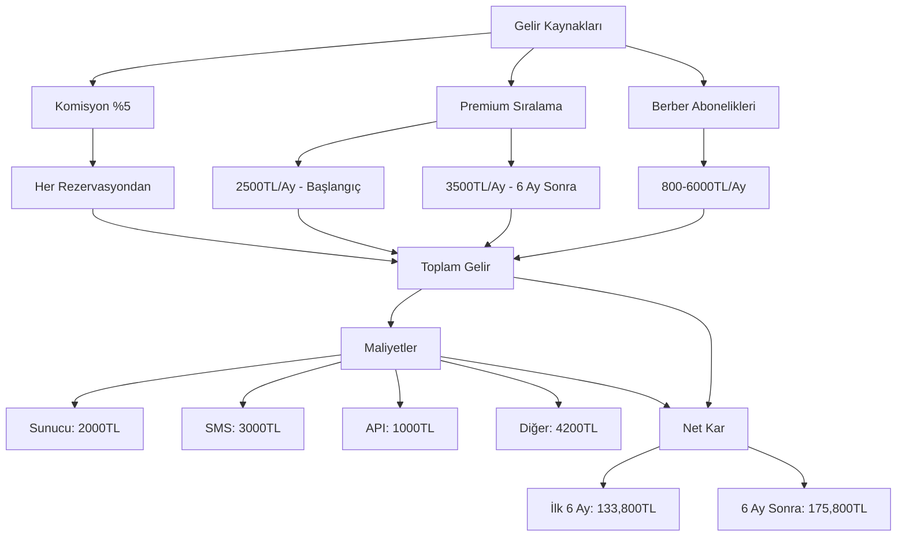
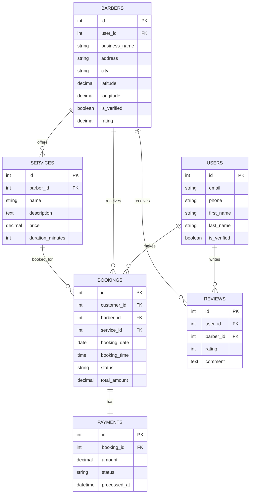

# Berber Rezervasyon Sistemi - Görsel Flowchart

## Ana Sistem Akışı

```mermaid
graph TD
    A[Müşteri Girişi] --> B{İl Seçimi}
    B --> C[Lefkoşa]
    B --> D[Girne]
    B --> E[Güzelyurt]
    B --> F[İskele]
    B --> G[Mağusa]
    B --> H[Lefke]
    
    C --> I[Berber Listesi]
    D --> I
    E --> I
    F --> I
    G --> I
    H --> I
    
    I --> J[Filtreleme]
    J --> K[Yakınlık]
    J --> L[Yıldız Puanı]
    J --> M[Hizmet Türü]
    
    K --> N[Berber Seçimi]
    L --> N
    M --> N
    
    N --> O[Hizmet Seçimi]
    O --> P[Tarih/Saat Seçimi]
    P --> Q[Ödeme]
    Q --> R[Rezervasyon Onayı]
    R --> S[Hizmet Alımı]
    S --> T[Berber Onayı]
    T --> U[Para Transferi]
```

## Ödeme ve İptal Sistemi

```mermaid
graph TD
    A[Ödeme Yapıldı] --> B[Para Havuzda]
    B --> C{Hizmet Alındı mı?}
    C -->|Evet| D[Berber Onayı]
    C -->|Hayır| E[İptal Durumu]
    
    D --> F{Berber Onayladı mı?}
    F -->|Evet| G[Para Berbere Transfer]
    F -->|Hayır| H[24 Saat Bekleme]
    H --> I{24 Saat Sonra?}
    I -->|Onaylandı| G
    I -->|Onaylanmadı| J[Para Havuzda Kalır]
    
    E --> K{İptal Zamanı}
    K -->|Aynı Gün| L[%50 İade]
    K -->|1 Gün Önceden| M[%100 İade]
    K -->|1 Saatten Az| N[İade Yok]
    
    G --> O[%5 Komisyon Kesintisi]
```

## Berber Kayıt Süreci

```mermaid
graph TD
    A[Berber Kayıt] --> B[Ustalık Belgesi Yükle]
    B --> C[Daire Sözleşmesi Yükle]
    C --> D[AI Kontrolü]
    D --> E{Belgeler Geçerli mi?}
    E -->|Hayır| F[Red - Düzeltme İste]
    E -->|Evet| G[Manuel Admin Onayı]
    F --> B
    
    G --> H{Admin Onayı}
    H -->|Red| I[Red Sebebi Bildir]
    H -->|Onay| J[1 Ay Bedava Deneme]
    
    J --> K[Ücretli Üyelik Seçimi]
    K --> L[1 Ay: 1000TL]
    K --> M[3 Ay: 2500TL]
    K --> N[6 Ay: 4000TL]
    K --> O[12 Ay: 6800TL]
```

## Para Kazanma Modeli (Optimize Edilmiş)

```mermaid
graph TD
    A[Gelir Kaynakları] --> B[Komisyon %5]
    A --> C[Premium Sıralama]
    A --> D[Berber Abonelikleri]
    
    B --> E[Her Rezervasyondan]
    C --> F[2500TL/Ay - Başlangıç]
    C --> F2[3500TL/Ay - 6 Ay Sonra]
    D --> G[800-6000TL/Ay]
    
    E --> H[Toplam Gelir]
    F --> H
    F2 --> H
    G --> H
    
    H --> I[Maliyetler]
    I --> J[Sunucu: 2000TL]
    I --> K[SMS: 3000TL]
    I --> L[API: 1000TL]
    I --> M[Diğer: 4200TL]
    
    H --> N[Net Kar]
    I --> N
    
    N --> O[İlk 6 Ay: 133,800TL]
    N --> P[6 Ay Sonra: 175,800TL]
```

## Veritabanı İlişkileri

```mermaid
erDiagram
    USERS ||--o{ BOOKINGS : "makes"
    BARBERS ||--o{ BOOKINGS : "receives"
    BARBERS ||--o{ SERVICES : "offers"
    SERVICES ||--o{ BOOKINGS : "booked_for"
    BOOKINGS ||--|| PAYMENTS : "has"
    USERS ||--o{ REVIEWS : "writes"
    BARBERS ||--o{ REVIEWS : "receives"
    
    USERS {
        int id PK
        string email
        string phone
        string first_name
        string last_name
        boolean is_verified
    }
    
    BARBERS {
        int id PK
        int user_id FK
        string business_name
        string address
        string city
        decimal latitude
        decimal longitude
        boolean is_verified
        decimal rating
    }
    
    SERVICES {
        int id PK
        int barber_id FK
        string name
        text description
        decimal price
        int duration_minutes
    }
    
    BOOKINGS {
        int id PK
        int customer_id FK
        int barber_id FK
        int service_id FK
        date booking_date
        time booking_time
        string status
        decimal total_amount
    }
    
    PAYMENTS {
        int id PK
        int booking_id FK
        decimal amount
        string status
        datetime processed_at
    }
    
    REVIEWS {
        int id PK
        int user_id FK
        int barber_id FK
        int rating
        text comment
    }
```
